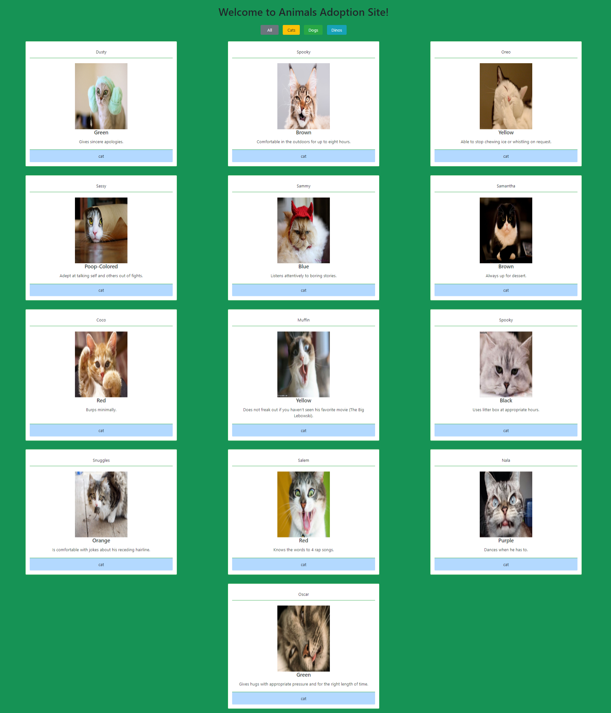
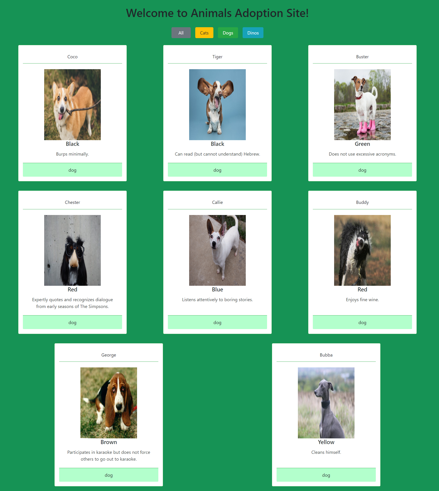
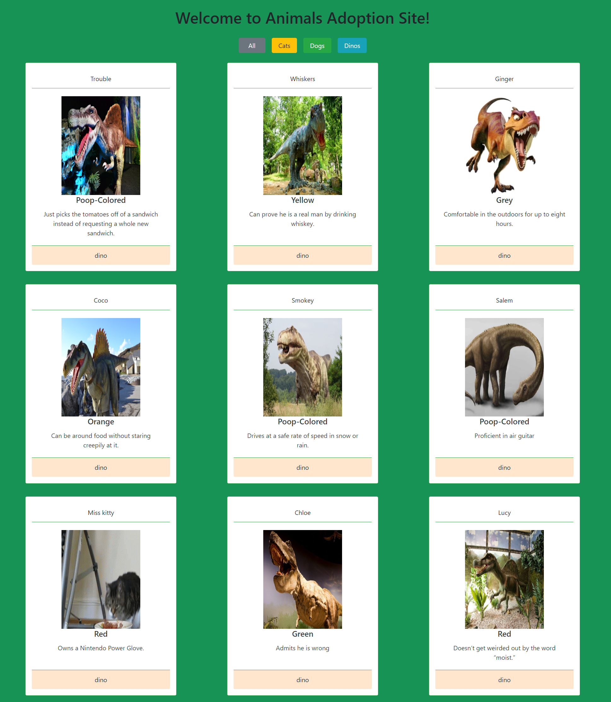

# Adoption
This project is an exploration of ES6modules, JSON and XHRrequest. The application is about pets adoption. It displays 30 pets cards. As a user, I can see 3 category(type) buttons printed at the top of the page. When you click one of the 3 buttons, then only the cards that are in the category(type)will show.


## Screenshots
1. Website Introduction Page


2. Filtered Cat Cards


3. Filtered Dogs Cards


4. Filtered Dinos Cards



## How to run this project
* Use npm to install http-server in your terminal:
```
npm install -g http-server
```
* Run the server
```
hs -p 9092
```
* Open chrome and navigate to :
```
localhost:9092
```
